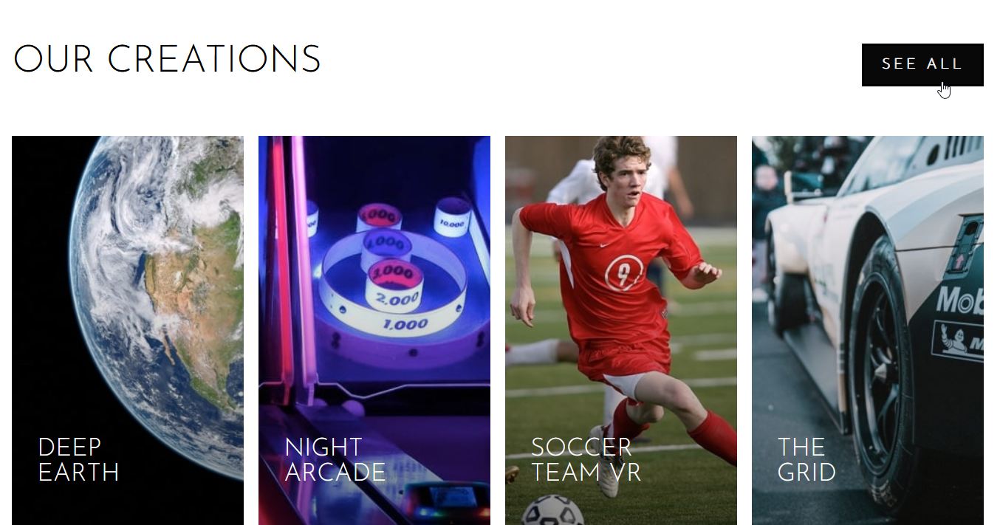
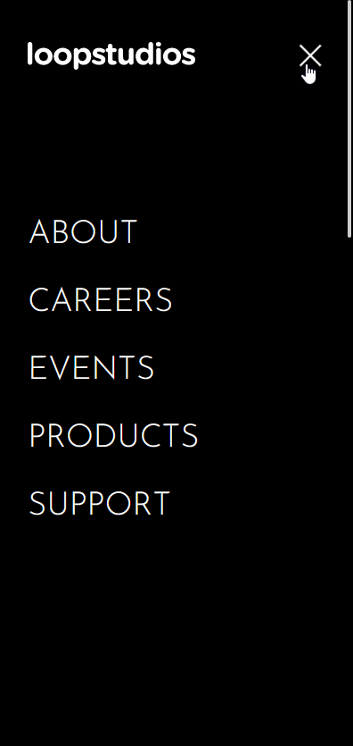
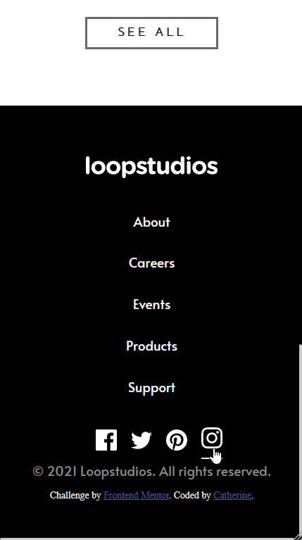

# Frontend Mentor - Loopstudios landing page solution

This is a solution to the [Loopstudios landing page challenge on Frontend Mentor](https://www.frontendmentor.io/challenges/loopstudios-landing-page-N88J5Onjw).

## Table of contents

- [Overview](#overview)
  - [The challenge](#the-challenge)
  - [Screenshot](#screenshot)
  - [Links](#links)
- [My process](#my-process)
  - [Built with](#built-with)
  - [What I learned](#what-i-learned)
  - [Continued development](#continued-development)
  - [Useful resources](#useful-resources)

**Note: Delete this note and update the table of contents based on what sections you keep.**

## Overview

### The challenge

Users should be able to:

- View the optimal layout for the site depending on their device's screen size
- See hover states for all interactive elements on the page

### Screenshot


- Desktop Banner 
- Desktop introduction 
- Desktop gallery 
- Mobile Banner 
- Mobile menu 
- Mobile gallery 
- Mobile footer 

### Links

- Solution URL: [Add solution URL here](https://your-solution-url.com)
- Live Site URL: [Add live site URL here](https://your-live-site-url.com)

## My process

### Built with

- Semantic HTML5 markup
- CSS custom properties
- Flexbox
- CSS Grid
- Mobile-first workflow

### What I learned

It's my first landing page built with CSS Grid. It wans't straight forward, espcially when it has to be responsive. So I have learned the following are quite useful: 


```css
minmax()

.menu-button::before,
.menu-button,
.menu-button::after {
    position: absolute;
    display: block;

}

linear-gradient()

```

### Continued development

It took me a while to understand how to utilise the linear gradient; also how to position it. It can be interesting to develop a dynamic image gallery with linear gradient.  


### Useful resources

- [A complete guide to Grid by css-tricks](https://css-tricks.com/snippets/css/complete-guide-grid/) - Excellent article for CSS grid.
- [Responsive menu](https://codepen.io/alvarotrigo/pen/MWEJEWG) - a very good example on codepen for the nativation menu. 
- [Responsive image](https://developer.mozilla.org/en-US/docs/Learn/HTML/Multimedia_and_embedding/Responsive_images) - well explained the concept of responsive images and how to create them. 

